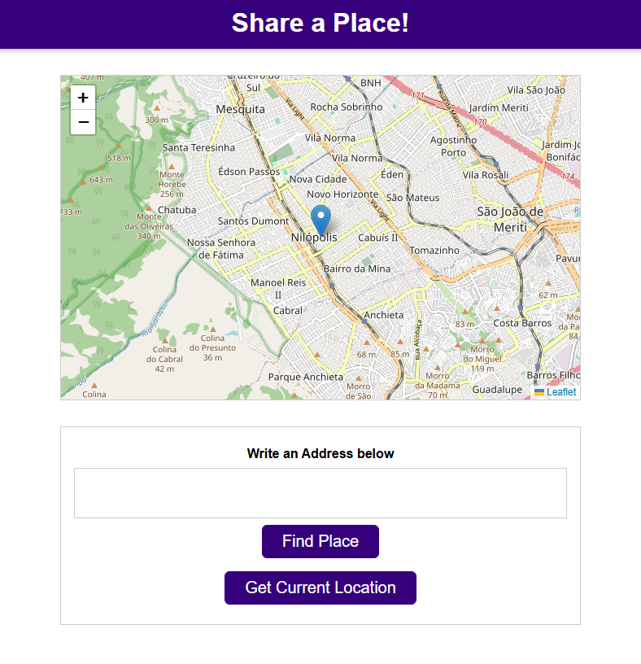

<div align="center">


# Anderson Toledo Martins Moreira

[](https://docs.google.com/document/d/1I8T4Mkb61NsTKN14ZbT1mnQKAc9LqiiPtgrYf9ayH1c/edit?usp=sharing)
[](https://docs.google.com/document/d/1vnFlRP3myxexgHk5Y6XaCKQGETPQwCygPZqGSblwCXg/edit?usp=sharing)
<br/>
[](https://www.linkedin.com/in/atmmoreira)
[](mailto:atmmoreira.rj@gmail.com?subject=From%20GitHub&cc=atmmoreira.rj@gmail&body=Hi,%20there.%20Found%20you%20from%20GitHub.)
[](https://api.whatsapp.com/send?phone=5521992890362)

</div>

<div align="center">


</div>

## Description

Share a Place is a Web app to locate and share places. Users can search for an address, get their current location via browser geolocation, and generate a shareable link with latitude, longitude, and address. The map is rendered with Leaflet and OpenStreetMap tiles, while address/coordinate conversion uses the Nominatim API.

### Features

- Search for an address and display it on the map.
- Get the user’s current location.
- Update the map and marker after selection.
- Generate a shareable link with address and coordinates.
- Copy the link to the clipboard.

## Screenshots

<div align="center">

Homepage layout



</div>

## Technologies

<!--
References for Create budgets :: https://shields.io/category/build
Icons: https://simpleicons.org/
-->


### Tools


## Project structure

```
.
├── docs/
│   └── logo/
├── public/
├── src/
│   ├── UI/
│   │   ├── Map.js
│   │   └── Modal.js
│   ├── Utility/
│   │   └── Location.js
│   ├── main.js
│   └── style.css
├── index.html
├── package.json
└── README.md
```

### Main files

- [src/main.js](src/main.js): handles search, geolocation, map updates, and sharing.
- [src/UI/Map.js](src/UI/Map.js): renders and updates the map with Leaflet.
- [src/UI/Modal.js](src/UI/Modal.js): loading modal during requests.
- [src/Utility/Location.js](src/Utility/Location.js): Nominatim integration for geocoding and reverse geocoding.
- [src/style.css](src/style.css): global UI styles.
- [index.html](index.html): base page structure.

## Running the project

### Prerequisites

- Node.js 18+ (recommended)
- npm
- Vite

### Steps

```bash
# Install dependencies
npm install

# Development server (Vite)
npm run dev

# Production build
npm run build

# Preview build
npm run preview

# After starting the dev server, open:
http://localhost:5173/
```
